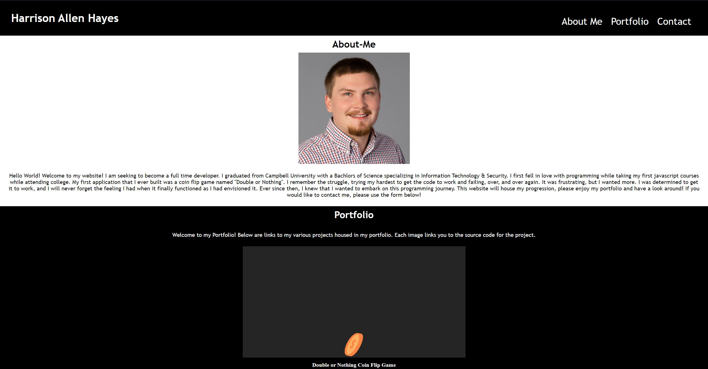

# Advanced-CSS

## Table of Contents:

- [Description](#description)
- [Usage](#usage)
- [Visuals](#visuals)
- [Resources](#resources)
- [Authors & Acknowledgement](#authors-and-acknowledgement)

## Description:

This website will house my portfolio and allow the user to view my previous projects as well as find out more about me.

## Usage:

A user is able to click on each of the options in the top right navigation bar and be brought to the corresponding subsection on the page.

A user can click each image and be brought to the corresponding deployed project in a separate tab.

A user can input text to the contact form.

## Visuals:

## Roadmap:

Implement email functionality for the contact form.

Implement more links to future projects.

## Resources:

[GitHub Repo](https://github.com/HarrisonHayes/Portfolio)

[Live Deployment](https://harrisonhayes.github.io/Portfolio/)

## Authors & Acknoledgement:

Harrison Hayes
